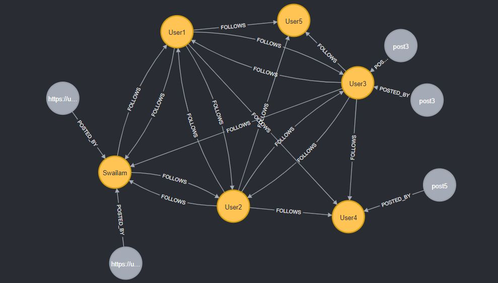

# social-media-neo4j-flask
## Project Overview


This Flask application with Neo4j and `neomodel` serves as a foundation for building social media web applications.using Neo4j graph database.

[Frontend repo](https://github.com/OmarSwailam/linkin)

## Features

- User registration and login with JWT (JSON Web Tokens) for authentication.
- Follow/unfollow users  
- See your feed and post updates  
- Comment, reply, like  
- Search users by there name, job title are skills they acquire  
- View connection degrees like +1, +2, +3 (just like LinkedIn)  

## Installation
## Using Docker
  make sure you have docker and docker compose installed on your machine
  1. Clone this repository to your local machine.
    ```
    git clone https://github.com/OmarSwailam/social-media-neo4j-flask.git
    ```
  2. Navigate to the project directory.
  3. Build and Run the application
     ```
      docker-compose up --build
     ```
  4. Testing the application
    ```
      Navigate to http://localhost:5000

      You can use this account to login

      Email: test@test.com
      password: 123456789

      Or register a new user and copy the <access token></access>
      in the top right above the available endpoints click the authorize button and type
      Bearer <access token>
    ```
## Normal installation
  1. Clone this repository to your local machine.
    ```
    git clone https://github.com/OmarSwailam/social-media-neo4j-flask.git
    ```
  2. Navigate to the project directory.
  3. Create a virtual environment (optional but recommended).
    ```
    python -m venv venv
    ```
  4. Activate the virtual environment
    ```
    venv/scripts/activate  # On Windows
    ```

  5. Install the required dependencies.
    ```
    pip install -r requirements.txt
    ```

  6. Run neo4j container using doker, or install it and run it locally
    [neo4j download and install docs](https://neo4j.com/docs/desktop-manual/current/installation/download-installation/)
    [neo4j docker image](https://hub.docker.com/_/neo4j)

  7. Run the python application
    ```
    python run.py
    ```
  8. Testing the application
    ```
      Navigate to http://localhost:5000

      You can use this account to login

      Email: test@test.com
      password: 123456789

      Or register a new user and copy the <access token></access>
      in the top right above the available endpoints click the authorize button and type
      Bearer <access token>
    ```
## Configuration

Feel free to edit the config.py file.

## Endpoints
The application provides swagger docs for easy testing.

## Contributing

Contributions are welcome! You can contribute to the project by:

- Reporting issues or suggesting improvements.
- Forking the repository and submitting pull requests.


Author: Omar Swailam